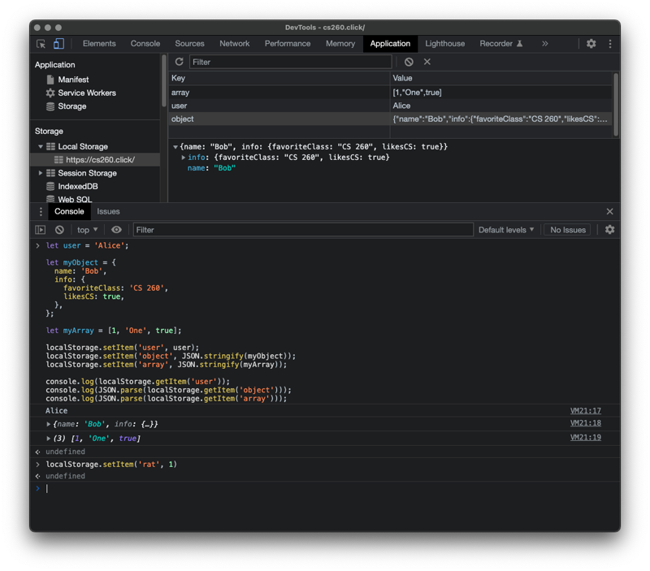

# Local storage

📖 **Deeper dive reading**: [MDN LocalStorage](https://developer.mozilla.org/en-US/docs/Web/API/Window/localStorage)

The browser's `localStorage` API provides the ability to persistently store and retrieve data (i.e. scores, usernames, etc.,) on a user's browser across user sessions and HTML page renderings. For example, your frontend JavaScript code could store a user's name on one HTML page, and then retrieve the name later when a different HTML page is loaded. The user's name will also be available in local storage the next time the same browser is used to access the same website.

In addition to persisting application data between page renderings, `localStorage` is also used as a cache for when data cannot be obtained from the server. For example, your frontend JavaScript could store the last high scores obtained from the service, and then display those scores in the future if the service is not available.

## How to use LocalStorage

There are four main functions that can be used with localStorage.

| Function             | Meaning                                      |
| -------------------- | -------------------------------------------- |
| setItem(name, value) | Sets a named item's value into local storage |
| getItem(name)        | Gets a named item's value from local storage |
| removeItem(name)     | Removes a named item from local storage      |
| clear()              | Clears all items in local storage            |

A local storage value must be of type `string`, `number`, or `boolean`. If you want to store a JavaScript object or array, then you must first convert it to a JSON string with `JSON.stringify()` on insertion, and parse it back to JavaScript with `JSON.parse()` when retrieved.

## Example

Open your startup website and run the following code in the browser's dev tools console window.

```js
let user = 'Alice';

let myObject = {
  name: 'Bob',
  info: {
    favoriteClass: 'CS 260',
    likesCS: true,
  },
};

let myArray = [1, 'One', true];

localStorage.setItem('user', user);
localStorage.setItem('object', JSON.stringify(myObject));
localStorage.setItem('array', JSON.stringify(myArray));

console.log(localStorage.getItem('user'));
console.log(JSON.parse(localStorage.getItem('object')));
console.log(JSON.parse(localStorage.getItem('array')));
```

**Output**

```sh
Alice
{name: 'Bob', info: {favoriteClass: 'CS 260', likesCS: true}
[1, 'One', true]
```

Notice that you are able to see the round trip journey of the local storage values in the console output. If you want to see what values are currently set for your application, then open the `Application` tab of the dev tools and select `Storage > Local Storage` and then your domain name. With the dev tools you can add, view, update, and delete any local storage values.


